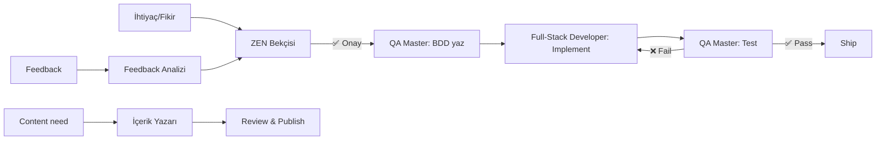

# Kaydet.link AI Agents

Kaydet.link projesinin geliştirilmesinde kullanılan AI agentları.

## 📋 Agent Listesi

| Agent | Emoji | Renk | Sorumluluk |
|-------|-------|------|------------|
| [Full-Stack Developer](./fullstack-developer.md) | 💻 | Mavi | Backend + Frontend development |
| [QA Master](./qa-master.md) | 🧪 | Yeşil | BDD senaryoları, test execution, kalite kontrolü |
| [ZEN Bekçisi](./zen-bekcisi.md) | 🛡️ | Mor | Feature kararlarının ZEN uyumluluğu |
| [İçerik Yazarı](./icerik-yazari.md) | ✍️ | Turuncu | Landing, blog, email metinleri |
| [Feedback Analizi](./feedback-analizi.md) | 📊 | Sarı | Kullanıcı feedback analizi ve önceliklendirme |

## 🚀 Hızlı Başlangıç

### Claude Code ile Kullanım

Agent'ları Claude Code'da doğrudan kullanabilirsiniz:

```bash
# Agent'ı çağır
@fullstack-developer Link sıralama özelliği ekle

# Veya doğrudan içerik yapıştır
[Agent dosyasının tüm içeriğini conversation'a yapıştır]
```

### Manuel Kullanım

1. İlgili agent dosyasını aç (örn: `fullstack-developer.md`)
2. Tüm içeriği kopyala
3. ChatGPT/Claude'a yapıştır
4. Görevini belirt

## 📖 Workflow Örnekleri

### Örnek 1: Yeni Feature Ekleme

```
1. Fikir: "Link sıralama özelliği ekleyelim"

2. @zen-bekcisi "Link sıralama özelliği ekleyelim mi?"
   → ✅ GO (ZEN'e uygun)

3. @qa-master "Link sıralama için BDD senaryoları yaz"
   → link_ordering.feature + step definitions

4. @fullstack-developer "Link sıralama özelliğini implement et"
   → Backend + Frontend kod + testler

5. @qa-master "Tüm testleri çalıştır ve raporla"
   → Test sonuçları + regression check

6. ✅ SHIP
```

### Örnek 2: Content Üretimi

```
1. İhtiyaç: Ali persona için landing page

2. @icerik-yazari "Ali persona için /mekan landing page'i yaz"
   → Hero, problem, solution, CTA, SEO metadata

3. Review + edit
4. Publish
```

### Örnek 3: Kullanıcı Feedback'i Değerlendirme

```
1. 20 feedback toplandı

2. @feedback-analizi [20 feedback yapıştır]
   → Temalaştırma + ZEN filter + action items

3. @zen-bekcisi [Feedback'den çıkan feature request'ler]
   → YAP/YAPMA/SONRA kararları

4. @fullstack-developer [Onaylanan feature'lar]
   → Implementation
```

## 🎯 Agent Sorumlulukları

### 💻 Full-Stack Developer
**Ne zaman kullan:**
- Yeni feature implement ederken
- Bug fix yaparken
- Code review isterken
- Refactoring gerektiğinde

**Erişim:**
- `docs/zen.md`, `docs/technical/technical_decisions.md`, `docs/focus.md`
- `src/backend/`, `src/frontend/`

**Çıktı:**
- Backend kod (Django)
- Frontend kod (Next.js + TypeScript)
- Tests (pytest + Jest)
- Migration (gerekirse)

---

### 🧪 QA Master
**Ne zaman kullan:**
- Yeni feature için test senaryoları yazarken
- Testleri çalıştırıp raporlarken
- Phase completion check ederken
- Regression test yaparken

**Erişim:**
- `src/tests/`, `docs/focus.md`, `docs/zen.md`
- `Justfile` (test komutları)

**Çıktı:**
- BDD scenarios (Gherkin)
- Step definitions (pytest-bdd)
- Test execution reports
- Acceptance validation reports

---

### 🛡️ ZEN Bekçisi
**Ne zaman kullan:**
- Yeni feature düşünürken
- Design kararı alırken
- Business direction belirlerken

**Erişim:**
- `docs/zen.md`, `docs/focus.md`

**Çıktı:**
- ✅ YAP / ⚠️ SONRA / ❌ YAPMA kararı
- ZEN prensip uyumluluk analizi
- Alternative öneriler

---

### ✍️ İçerik Yazarı
**Ne zaman kullan:**
- Landing page yazarken
- Blog post üretirken
- Email template oluştururken
- Social media copy yazarken

**Erişim:**
- `docs/marketing/brand-voice.md`
- `docs/product/personas.md`
- `docs/marketing/seo_content_strategy.md`

**Çıktı:**
- Landing page copy
- Blog posts (600-800 kelime)
- Email templates
- Social media captions

---

### 📊 Feedback Analizi
**Ne zaman kullan:**
- Kullanıcı feedback'i topladığında
- Phase completion review'da
- Feature launch sonrası
- Aylık product review

**Erişim:**
- `docs/zen.md`, `docs/product/personas.md`, `docs/focus.md`

**Çıktı:**
- Temalaştırılmış feedback
- ZEN-filtered action items
- Persona mapping
- Priority ranking

## ⚙️ Agent Koordinasyonu

Agent'lar birlikte çalışabilir:



## 📚 Dokümantasyon

Her agent dosyası şunları içerir:

1. **Metadata:**
   - `agentName`: Agent adı
   - `color`: Renk (görsel tanıma)
   - `emoji`: Emoji
   - `description`: Kısa açıklama

2. **Sorumluluk:** Ne yapar?

3. **Erişim:** Hangi dosyalara bakmalı?

4. **İlk Mesaj:** Agent'ın karşılama mesajı

5. **Çalışma Prensipleri:** Nasıl çalışır?

6. **Örnekler:** Gerçek kullanım senaryoları

7. **Success Criteria:** Ne zaman başarılı sayılır?

## 🔄 Agent Güncelleme

Agent'lar projeyle birlikte evrilir:

- `docs/focus.md` değiştiğinde → Agent'lar yeni phase'i bilir
- `docs/zen.md` güncellendiğinde → ZEN Bekçisi yeni prensipleri uygular
- Tech stack değiştiğinde → Full-Stack Developer yeni stack'i bilir

Agent dosyalarını güncel tutmak için:
1. Docs değiştiğinde ilgili agent'ı güncelle
2. Agent kullanımında problem varsa dosyayı revize et
3. Yeni pattern bulunduğunda "Örnekler" bölümüne ekle

## 💡 İpuçları

1. **Tek seferde tek agent:** Birden fazla agent'ı aynı conversation'da kullanma, karışır
2. **Context ver:** Agent'a görevi verirken mevcut durumu da anlat
3. **Iterate et:** İlk çıktı yetersizse detaylandır, sor
4. **ZEN önce:** Her zaman ZEN Bekçisi'nden geç, sonra dev'e git
5. **Test yaz önce:** QA Master'ın senaryolarını Full-Stack Developer görsün

## 🐛 Sorun Giderme

**Agent yanlış output veriyor:**
- Agent dosyasındaki "Örnekler" bölümünü kontrol et
- Context'i daha detaylı ver
- İlgili docs dosyalarını conversation'a ekle

**Agent ZEN'i yanlış yorumluyor:**
- `docs/zen.md` içeriğini conversation'a yapıştır
- Spesifik ZEN prensibi referans ver

**Agent eski stack'i kullanıyor:**
- `docs/technical/technical_decisions.md` ekle
- "Tech stack şu anda şöyle" diye belirt

## 📞 Destek

Agent'larla ilgili soru/öneri:
- Issue aç: GitHub Issues
- Docs güncelle: PR gönder
- Yeni agent öner: Discussions

---

**Last Updated:** 2024-11-19
**Version:** 1.0.0
